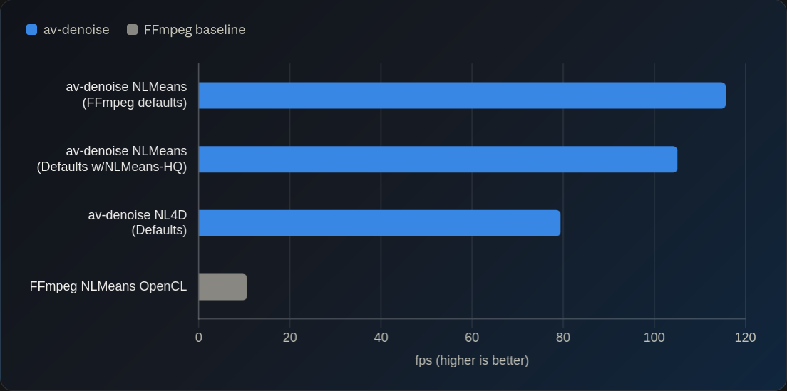
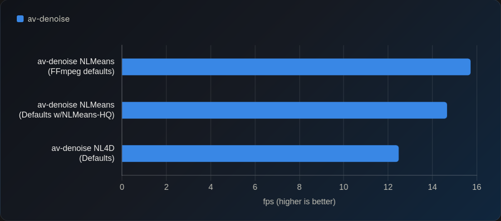
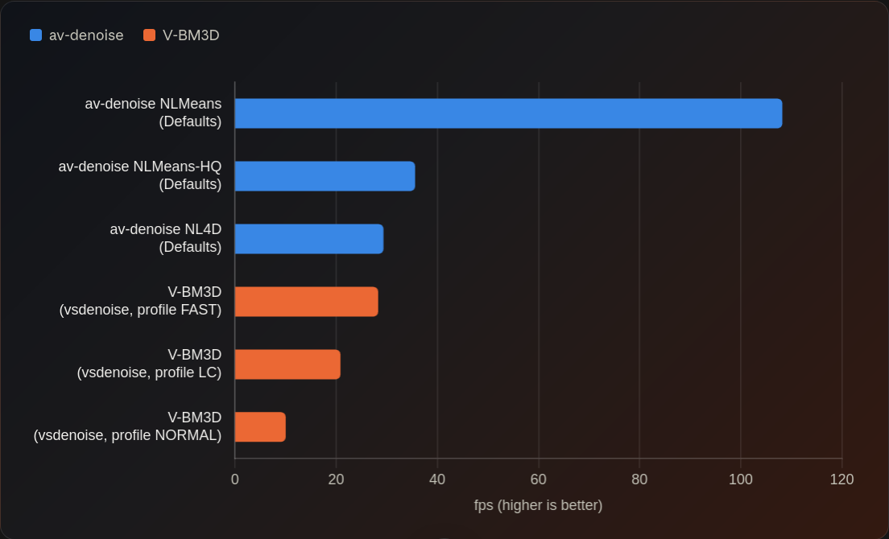
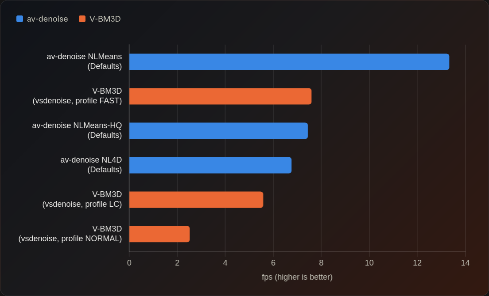

# av-denoise

Faster and higher quality denoising for all.

This project was originally heavily inspired by [KNLmeansCL](https://github.com/Khanattila/KNLMeansCL) alongside 
FFmpeg's NLMeans implementation but is built to be a more standalone tool built and provide a more advanced denoising
experience and eventually growing beyond NLMeans.

av-denoise features **NLMeans**, **NLMeans-HQ** and **NL4D** algorithms offering significant advantages over existing
denoising tools.



## Features

- **Simple tuning presets** - the `--preset` ladder (`veryfast` → `veryslow`) automatically adjusts denoiser settings
  without requiring you to modify many sets of parameters for every input.
- **NL4D Algorithm** - Offers best in class noise removal and detail retention while being faster than more standard
  V-BM3D algorithms and without the artefacts.
- **NLMeans-HQ Algorithm** - A smarter NLMeans denoiser able to process motion and detail extraction far better than
  traditional NLMeans.
- **Automatic noise handling** - Both _NL4D_ and _NLMeans-HQ_ offer automatic noise estimation removing the need to
  manually specify a tuned `sigma` parameter for every source, offering a simple to use `sigma-scale` flag for increasing
  or decreasing the relative denoise strength.
- **Temporal denoising with motion awareness** - up to 17-frame windows, per-neighbour block-match confidence, 
  and opt-in on-GPU motion compensation.
- **Luma, chroma, and YUV444 kernels** - spatial or temporal, each plane individually tunable.
- **Library and binary** - y4m over a pipe, or direct file ingestion via FFMS2 with
  scene-parallel workers.
- **8, 10, and 12-bit** - depth is detected from the source and preserved on output. Tuning parameters are normalized
  across bit-depth.
- _**Fast!**_ - around **2x** FFmpeg's `nlmeans_opencl` at matched settings and **~1.3x** faster than V-BM3DHIP.
  - Piped input can't parallelize across scenes, so file input makes the best use of big GPUs.
- **VapourSynth Plugin** - [Available on PyPi](https://pypi.org/project/vsavd/) for integrating within your existing
  pipelines.
  - Please be aware that due to VS API limitations the NLMeans-HQ and NL4D algorithms are very heavily limited and
    performance is suboptimal from what it could be. For best performance we recommend using the CLI and then feeding
    the output into VS separately.

---


## Tutorials

### [Tutorial for CLI](https://github.com/ChillFish8/av-denoise/blob/HEAD/docs/TUTORIAL-CLI.md)

##### [Example commands](https://github.com/ChillFish8/av-denoise/blob/HEAD/docs/TUTORIAL-CLI.md#example-commands)

##### [Binary usage and flag reference](https://github.com/ChillFish8/av-denoise/blob/HEAD/docs/TUTORIAL-CLI.md#binary-usage)


### [Tutorial for VapourSynth](https://github.com/ChillFish8/av-denoise/blob/HEAD/av-denoise-vs/README.md)


## Installing Summary

`av-denoise` is available both in library, VapourSynth plugin and binary format.

### [Installation for CLI](https://github.com/ChillFish8/av-denoise/blob/HEAD/docs/TUTORIAL-CLI.md#installation)

### [Installation for VapourSynth](https://github.com/ChillFish8/av-denoise/blob/HEAD/av-denoise-vs/README.md#installing)

### [Container images](https://github.com/ChillFish8/av-denoise/blob/HEAD/docs/TUTORIAL-CLI.md#container-images)

Images are published to GHCR as `ghcr.io/chillfish8/av-denoise:<backend>-<version>`, one per accelerator
backend (`vulkan`, `cuda`, `rocm`).

### As a library

```bash
cargo add av-denoise
```

## [Choosing an algorithm](https://github.com/ChillFish8/av-denoise/blob/HEAD/docs/CHOOSING_AN_ALGORITHM.md)

A guide to help you understand what each algorithm offers and pick which one is best for you.


## ["Don't do this!"](https://github.com/ChillFish8/av-denoise/blob/HEAD/docs/DONT_DO_THIS.md)

Common footguns to avoid and why.


## Tuning guides

There are dedicated docs for how to adjust each algorithm and tune it for your tastes, assuming the defaults
don't already do what you want.

#### [Tuning guide for CLI](https://github.com/ChillFish8/av-denoise/blob/HEAD/docs/TUNING-CLI.md)

#### [Tuning guide for VapourSynth](https://github.com/ChillFish8/av-denoise/blob/HEAD/docs/TUNING-VS.md)

---

## Hardware support

The project supports the following accelerators/gpus:

- **AMD GPUs** (via the `rocm` or `vulkan` features)
- **Intel GPUs** (via the `vulkan` feature)
- **Nvidia GPUs** (via the `cuda` or `vulkan` features)
- **Apple Silicon** (via the `metal` feature)

Run `av-denoise list-devices` to see which of these your machine offers and what to pass to
`--device`.

Every global flag also reads an environment variable named after it with an `AVD_` prefix, so
`AVD_DEVICE=discrete:1` pins a card for a whole shell. `AVD_ACCELERATORS`, `AVD_PRESET`,
`AVD_CHANNEL_MODE` and `AVD_PROGRESS` work the same way. A flag given on the command line wins
over its variable.

There is no software backend. The collaborative filter aggregates its filtered patches through
atomic floating-point adds, and CubeCL's CPU runtime does not implement atomics. A software
*device* is still reachable with `--device cpu` where the platform provides one, such as lavapipe
under Vulkan.

## Benchmarks

### CLI - 1080p 8-bit


### CLI - 4K 10-bit



### VS Plugin  - 1080p 8-bit



### VS Plugin  - 4K 10-bit



### Notes about the JIT

It is important to note that `av-denoise` internally uses a JIT (Just In Time) compiler for its kernels. This means
that the kernels are compiled and optimised for your specific hardware _at runtime._ As such, the first a couple of
calls will have significant overhead as the system compiles, optimises and caches the kernels.

Additionally, because the kernels are compiled at runtime, whatever environment you run the tool in,
must also provide access to the hardware specific headers and compilers.

This primarily has the following impacts:

- The `rocm` backend requires the AMD HIP compiler and headers, typically vendored via the ROCm dev SDK.
- The `cuda` backend requires the NVIDIA CUDA headers and nvcc, typically vendored via the CUDA devel toolkit.
- The `vulkan` and `metal` backends should "just work" on non-containerised hosts. If you are building for
  docker, then the vulkan backend requires `vulkan-icd-loader` and then the relevant GPU specific driver,
  i.e. `vulkan-radeon` or `vulkan-intel`.

Since both the CUDA and ROCm backends are very heavy in terms of dependencies, I recommend just using the `vulkan`
backend for those devices. It should be more or less the same performance, without all the library headache.

#### Compiled kernel cache

Compiling the kernels takes about ten seconds when you first start the denoising pipeline. 
These compiled kernels get cached on disk, which makes that a cost paid once per machine rather than once per run.

By default, the cache lives in `av-denoise` inside the platform cache directory, which is `$XDG_CACHE_HOME` or
`~/.cache` on Linux and macOS, and `%LOCALAPPDATA%` on Windows. With no platform cache directory at all, it falls
back to `av-denoise` inside the temporary directory and warns.

- `AV_DENOISE_COMPILATION_CACHE=/some/dir` puts the compiled-kernel and autotune caches somewhere else, which is
  what CI runs and containers use to keep the cache on a mounted volume. It overrides whatever is in `cubecl.toml`.
- `AV_DENOISE_COMPILATION_CACHE=off` disables caching entirely. Use this when benchmarking, because a warm cache
  hides the compilation cost a first run pays.

If the cache directory cannot be created, `av-denoise` logs a warning and carries on without a cache.

Library users can call `av_denoise::install_compilation_cache()` before `Denoiser::create` to get the same
behaviour in their own binary. It has to run before the first `Denoiser` exists, because building a CubeCL client
locks the global config. An embedder that wants to choose the cache directory itself can call
`av_denoise::default_cache_dir()` to get the same default this crate uses, and
`av_denoise::install_compilation_cache_at()` to install it, or any other directory, directly.
